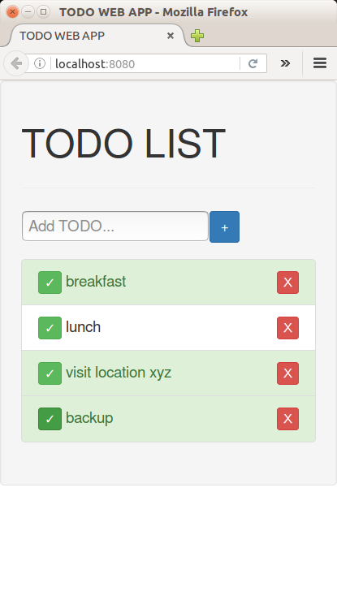
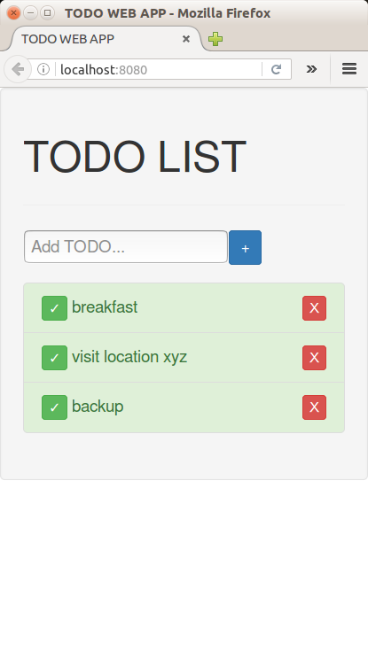

# TODO WEB APP
A Simple TODO web app made in React with the localstorage and database backup features.

##QuickStart

###To install the TODO app:
* 1. git clone https://github.com/Prabhnith/TodoWebApp.git
* 2. cd TodoWebApp
* 3. npm install
* 4. npm start
* 5. check out on localhost:8080 

###Set up database:
* 1. run postgres psql
* 2. CREATE DATABASE tododb;
* 3. \c tododb;
* 4. CREATE user todo with password 'todo123'

###To start the server:
* 1. open other terminal and `cd todoWebApp` 
* 2. execute command $`python3 Createtable.py` whenever you want to reset entries of table `todo` 
* 3. Start the server $`go run todowebserver.go` 

##ScreenShots

`                   `

